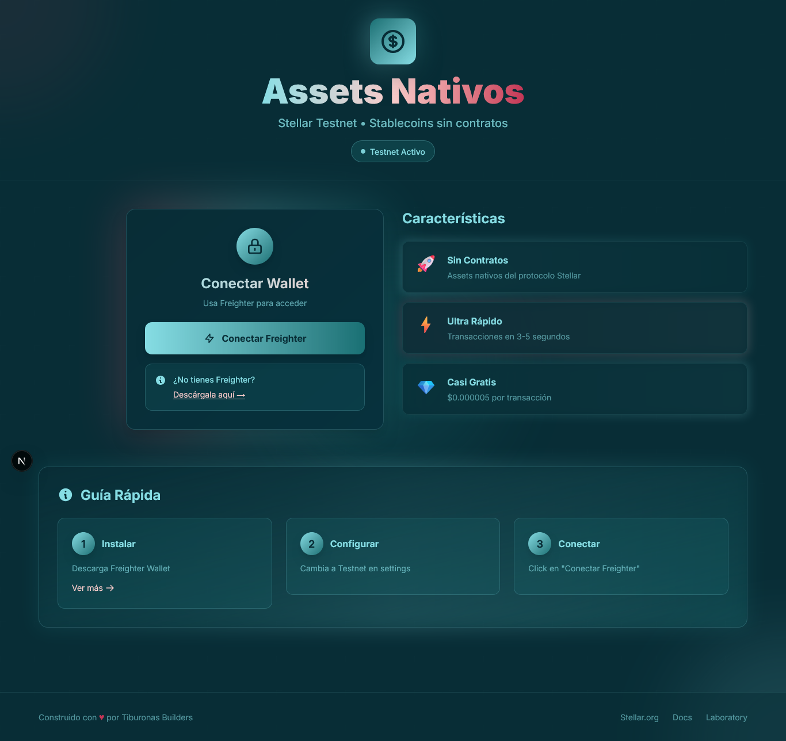
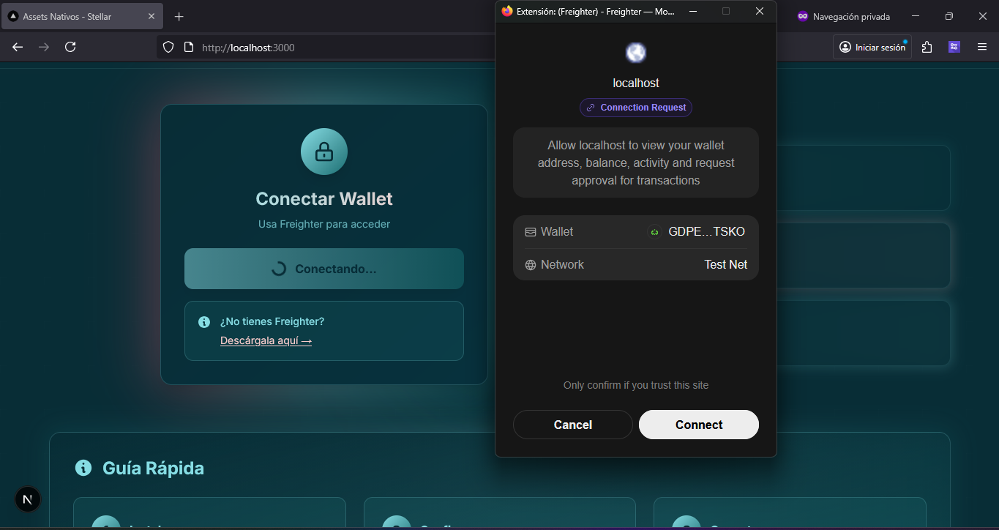
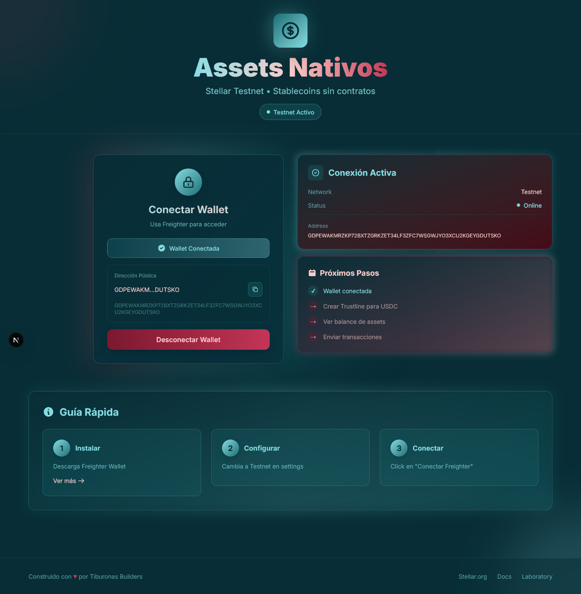

# 🦈 DApp Stellar Assets - Conexión con Freighter Wallet

## 📋 Descripción del Proyecto
Esta es una aplicación **Next.js** que permite conectar y desconectar la **wallet Freighter**, mostrando la dirección pública del usuario en **Stellar Testnet**.  

---

## 🚀 Características
✅ Conexión/Desconexión de Freighter Wallet  
✅ Visualización de dirección pública formateada  
✅ Copia al portapapeles con feedback visual  
✅ Diseño moderno con gradientes y efectos glassmorphism  
✅ Manejo de errores robusto  
✅ Responsive design para todos los dispositivos  
✅ Indicadores visuales de estado de conexión  

---

## 🛠 Tecnologías Utilizadas
- **Next.js 14** – Framework de React  
- **TypeScript** – Tipado estático  
- **Tailwind CSS** – Estilos y diseño  
- **Stellar Freighter API** – Conexión con wallet  
- **Supabase** – Cliente de base de datos (preparado)

---

## 📦 Estructura del Proyecto
```

dapp-stellar-assets/
├── src/
│   ├── app/
│   │   ├── layout.tsx          # Layout principal
│   │   ├── page.tsx            # Página principal
│   │   └── globals.css         # Estilos globales
│   ├── components/
│   │   ├── WalletConnect.tsx   # Componente de conexión
│   │   ├── Spinner.tsx         # Spinner de carga
│   │   └── types/
│   │       └── freighter.d.ts  # Tipos para Freighter
│   └── lib/
│       ├── supabase.ts         # Cliente de Supabase
│       └── constants.ts        # Constantes de Stellar
├── public/                     # Archivos estáticos
├── tailwind.config.ts          # Configuración de Tailwind
└── package.json

````

---

## ⚙️ Configuración Requerida

### 🔐 Variables de Entorno
Crea un archivo **`.env.local`** en la raíz del proyecto:

```env
NEXT_PUBLIC_SUPABASE_URL=tu_url_de_supabase
NEXT_PUBLIC_SUPABASE_ANON_KEY=tu_clave_anonima_de_supabase
````

### 📦 Instalación de Dependencias

```bash
npm install
```

---

## 🎯 Funcionalidades Implementadas

### 1. Conexión con Freighter Wallet

* Verifica si Freighter está instalado
* Solicita permisos de conexión
* Obtiene la dirección pública del usuario

### 2. Estados de Conexión

* **No conectado:** Muestra botón de conexión
* **Conectando:** Muestra spinner y estado de carga
* **Conectado:** Muestra dirección y botón de desconexión

### 3. Características de UX

* Formateo de dirección (primeros 8 y últimos 6 caracteres)
* Copia al portapapeles con feedback visual
* Manejo de errores con mensajes claros
* Diseño responsive adaptable a móviles y escritorio

---

## 🧪 Pruebas Realizadas

✅ **Prueba 1: Wallet NO instalada**
Comportamiento: muestra error “Freighter no está instalado”
**Resultado:** ✅ Implementado

✅ **Prueba 2: Wallet instalada pero bloqueada**
Comportamiento: Freighter pide desbloquear con password
**Resultado:** ✅ Implementado

✅ **Prueba 3: Conexión exitosa**
Comportamiento: muestra dirección pública (empieza con G...)
**Resultado:** ✅ Implementado

✅ **Prueba 4: Desconexión**
Comportamiento: vuelve al estado inicial
**Resultado:** ✅ Implementado

---

## 🚀 Ejecución del Proyecto

### Modo Desarrollo

```bash
npm run dev
```

Abre [http://localhost:3000](http://localhost:3000) en tu navegador.

### Modo Producción

```bash
npm run build
npm start
```

---

## 📸 Capturas de Pantalla

### Estado Inicial - No Conectado

📷 
Interfaz inicial con botón de conexión.

### Estado Conectado

📷 ``
Vista mostrando la dirección pública.

### Proceso de Conexión

📷 
Animación de carga y conexión.

### Manejo de Errores

📷 `public/screenshots/error-state.png`
Mensajes de error amigables y visibles.

---

## 📱 Vistas de la Aplicación

### 🟦 Estado Inicial

```
🦈 Assets Nativos  
Stellar Testnet • Stablecoins sin contratos

[🔗 Conectar Freighter]

Características:
• Sin Contratos  
• Ultra Rápido  
• Casi Gratis
```

### 🟩 Estado Conectado

```
✅ Wallet Conectada  
Dirección: GDPEWA...DUTSKO  

📊 Conexión Activa  
Network: Testnet  
Status: Online
```

---

## 🔧 Componentes Principales

### `WalletConnect.tsx`

* Maneja la lógica de conexión/desconexión
* Estados de loading y error
* Copia al portapapeles
* Diseño con gradientes y efectos visuales

### `page.tsx`

* Página principal con layout responsive
* Muestra contenido dinámico según conexión
* Sección de bienvenida e información

---

## 🎓 Lo que Aprendí

✅ Verificar si Freighter está instalado (`isConnected()`)  
✅ Obtener la clave pública del usuario (`getAddress()`)  
✅ Manejar estados de conexión con `useState` y `useEffect`  
✅ Implementar manejo de errores claro  
✅ Diseñar interfaces modernas con Tailwind CSS  
✅ Usar TypeScript para tipado seguro  
✅ Aplicar efectos visuales avanzados (gradientes, blur, animaciones)  

---

## 🚀 Próximos Pasos (Basado en la Clase 7)

Esta aplicación está preparada para integrar:

* Creación de **Trustlines** para USDC
* Consulta de **balances de assets nativos**
* Envío de **transacciones en Stellar**
* Integración con **Supabase** para persistencia de datos

---

## 🎨 Diseño y Estilos

### 🎨 Paleta de Colores

| Elemento        | Color                | Descripción          |
| --------------- | -------------------- | -------------------- |
| Fondo principal | `#082D36`            | Azul oscuro          |
| Acentos         | `#86DDE4`, `#197074` | Cian / Verde azulado |
| Énfasis         | `#C43556`, `#F9CCCB` | Coral / Rosa claro   |

### ✨ Efectos Visuales

* Gradientes animados en fondos
* Efectos *glassmorphism* con `backdrop-blur`
* Sombras suaves y bordes con opacidad
* Transiciones suaves en hover

---

## 📚 Recursos

* [Freighter Wallet](https://www.freighter.app)
* [Documentación de Stellar](https://developers.stellar.org/docs)
* [Next.js Documentation](https://nextjs.org/docs)

---

## 👥 Autor

**Tiburonas Builders**
TAREA 4: *Assets Nativos en Stellar*


